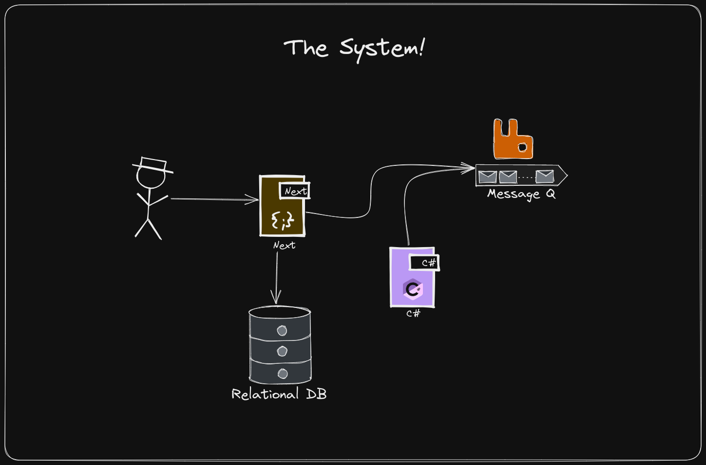

# VSCode Powerups

Welcome to VSCode Powerups! This app shows no real purpose other than to show the usage of different technologies, and how VSCode and Containers can be used to optimise the developer experience. This project contains the slides for the corresponding presentation along with the short notes of the presentation (located in `docs/00-slides/`).

## Architecture

This application is purposely simple, it doesn't do much but does have multiple technologies and moving parts. See the simplified Architecture diagram below

## Getting Started

The repo has multiple `README.md` documents under the `docs/` folder, each of which documents how you would start the application with a particular level of Docker and VSCode configuration.

- [docs/01-manual](docs/01-manual/README.md)
  - The manual configuration of the application, forcing the user to install dependencies and manually configure individual services before running them.
- [docs/02-docker](docs/02-docker/README.md)
  - Start automating the more arduous parts of running the system, install docker and run the RabbitMQ and PostgreSQL services via Docker.
- [docs/03-workspace](docs/03-workspace/README.md)
  - Adds an additional VSCode Workspace, which includes debug configurations for the services, allowing you to start and debug all services in the application.
- [docs/04-dev-containers](docs/04-dev-containers/README.md)
  - Adds an additional Dev Container which will allow VSCode to auto start RabbitMQ and PostgreSQL services automatically in an isolated container. Allowing for an "instant" developer experience.
- [docs/05-codespaces](docs/05-codespaces/README.md)
  - Effectively the same configuration as the Dev Container in Step 4 - just using the cloud compute services from Github.

## Background

This repo is designed to go alongside a talk for an Entelect Coffee && Code, an internal training talk. The actual code in this repo is mostly sample code to show basic debug functionality, rather than anything complex. The core focus of this repo is for the Dev Container and Workspace configuration examples.

## Resources

- [Codespaces](https://docs.github.com/en/codespaces/overview)
- [Github - Introduction to Dev Containers](https://docs.github.com/en/codespaces/setting-up-your-project-for-codespaces/adding-a-dev-container-configuration/introduction-to-dev-containers)
- [Microsoft - Dev Containers](https://code.visualstudio.com/docs/devcontainers/containers)
- [VSCode Workspaces](https://code.visualstudio.com/docs/editor/workspaces)
