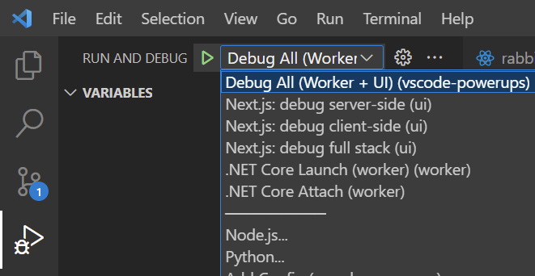
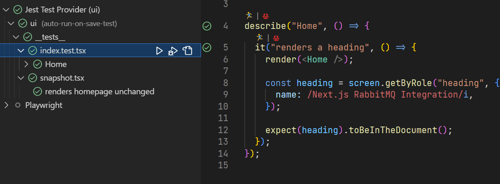

# VSCode Powerups - VSCode Workspace Configuration

Welcome to VSCode Powerups! This app shows no real purpose other than to show the usage of different technologies, and how VSCode and Containers can be used to optimise the developer experience.

This is Step 3, keeping our docker configuration, we now have the addition of a VSCode workspace.

## Prerequisites

Please ensure that you have the following services installed on your machine:

- [Docker](https://docs.docker.com/get-docker/)
- [NodeJS](https://nodejs.org/en/download/)
- [Dotnet](https://dotnet.microsoft.com/en-us/download)
- [VSCode](https://code.visualstudio.com/download)

> **Note**: To use Docker Desktop professionally you will require a License, it is available freely for personal usage.

## Configuration

- Duplicate the root `.env.example` file to make a `.env` (*note*: this file is gitignored to preserve secrets)
  - **Optional**: Customize the secrets in your local `.env` file (*note*: This will require updating default connections in worker and UI)
- Open the `vscode-powerups.code-workspace` workspace configuration in VSCode.

## Getting Started

- Run `docker-compose up` to start RabbitMQ and Postgres services
- Select `Debug All (Worker + UI)` debug configuration and click "Play"
  - Individual debug configurations are also available for UI and Worker
  - All services are now available for debugging

### Testing

- In order to run tests in the **UI** application run the following in `ui/`
  - `npm test`
- Individual tests can be run and debugged from within VSCode via the `jest` extension

## Commentary

This steps builds on top of the service automation introduced with [Docker](https://docs.docker.com) in the [previous step](../02-docker/README.md). The workspace brings in quality of life improvements in VSCode, such as intellisense, debugging, testing and extensions.

It is worth noting that all CLI options are still available to run the application, and this setup uses industry standard configuration files (eslint, tsc, etc.). This ensures that the VScode configuration is not forced, and other tools or IDEs can be used.

### Debugging

Debug configurations are provided to quickly start up applications in watch mode with relevant configuration.



Launching the `Debug All (Worker + UI)` will launch all applications in debug mode automatically, including browser with client debugging. Additional debug configurations can be added to the `.vscode/launch.json` files as needed, e.g.

### Testing Setup

Tests can now be run and debugged from within VSCode via the `jest` extension.



### Recommended Configuration

The VSCode workspace contains various configuration items to recommend how developers should run the stack, for example:

```json
{
  ...,
  "settings": {
    "editor.codeActionsOnSave": {
      "source.organizeImports": true,
      "source.fixAll": true,
      "source.fixAll.markdownlint": false
    },
    "jest.disabledWorkspaceFolders": ["worker", "vscode-powerups", "docs"],
    "omnisharp.useModernNet": true,
    ...,
  }
}
```

This example configuration above tells the developers VSCode to auto format on save, and informs some default configuration for Omnisharp (C#) and Jest extensions. There are many more available in the `vscode-powerups.code-workspace` file.

### Extensions

The VSCode workspace contains recommended extensions that are optionally installed by developers openning the project, for example:

```json
{
  ...,
  "extensions": {
    "recommendations": [
      "ms-vscode-remote.remote-containers",
      "mikestead.dotenv",
      "github.codespaces",
      "xabikos.javascriptsnippets",
      "ms-dotnettools.csharp",
      ...,
    ],
  }
}
```

The above shows the syntax for recommended extensions, these can be added too and evolved as needed.

> Click here to go back to [../../README.md](../../README.md)
