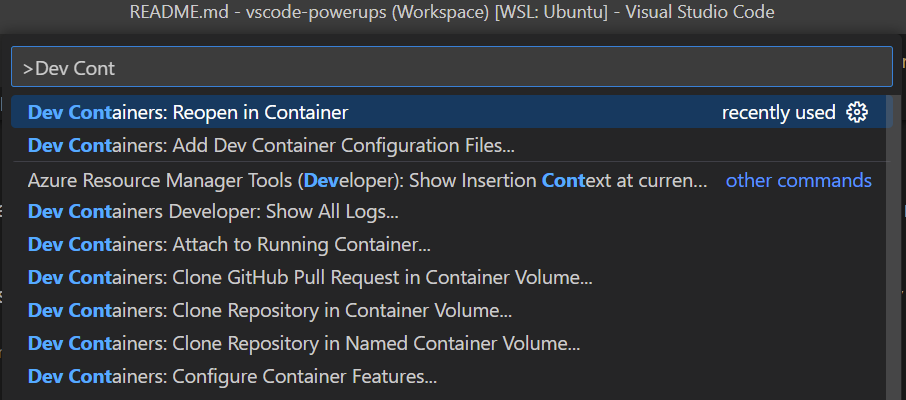

# VSCode Powerups - Dev Container Configuration

Welcome to VSCode Powerups! This app shows no real purpose other than to show the usage of different technologies, and how VSCode and Containers can be used to optimise the developer experience.

Step 4 time! This step introduces a Dev Container to the stack - remember to open this project *as a dev container* in VSCode.

## Prerequisites

Please ensure that you have the following services installed on your machine:

- [Docker](https://docs.docker.com/get-docker/)
- [VSCode](https://code.visualstudio.com/download)

> **Note**: To use Docker Desktop professionally you will require a License, it is available freely for personal usage.

## Configuration

- Open the `vscode-powerups.code-workspace` as a Dev Container by opening in VSCode and running `Dev Containers: Reopen in Container`

## Getting Started

- Select `Debug All (Worker + UI)` debug configuration and click "Play"
  - Individual debug configurations are also available for UI and Worker
  - All services are now available for debugging

### Testing

- In order to run tests in the **UI** application run the following in `ui/`
  - `npm test`
- Individual tests can be run and debugged from within VSCode via the `jest` extension

## Commentary

This step continues to utilise the workspace configuration from the [previous step](../03-workspace/README.md). This adds a `.devcontainer/` folder to the project with various configurations informing VSCode how to start the application as a dev container.

### Dev Containers

The Dev container will likely be prompted on first open of the project, if not it can be opened manually from the Command Palette in VSCode (default `ctrl+shift+P`) and running `Dev Containers: Reopen in Container`.



The dev container will automatically duplicate the `.env.example` file to create `.env` file, as per the following configuration:

```json
  "name": "C# (.NET) and PostgreSQL",
  "dockerComposeFile": [
    "../docker-compose.yml",
    "../docker-compose.devcontainer.yml"
  ],
  "service": "app",
  "workspaceFolder": "/workspaces/vscode-powerups",
  "features": {
    "ghcr.io/devcontainers/features/docker-outside-of-docker:1": {},
    "ghcr.io/devcontainers/features/node:1": {}
  },
  "initializeCommand": "cp -u .env.example .env",
  "postAttachCommand": "sh -c 'cd worker && dotnet restore' && sh -c 'cd ui && npm install'"
  ...,
}
```

Before creating the Container this will create a `.env` file on behalf of the developer, and will automatically run the `dotnet restore` and `npm install` tasks for the user. The full configuration is available in `.devcontainer/devcontainer.json`.

The Dev Container runs inside of a docker container, which is started alongside the `docker-compose.yml` from previous steps, adding in a new service called `app`. The `app` container is where VSCode will open up a Code Server, and running all remote development services.

> Click here to go back to [../../README.md](../../README.md)
