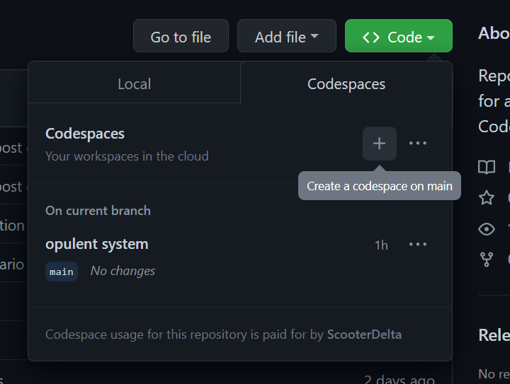

# VSCode Powerups - Workspace Configuration

Welcome to VSCode Powerups! This app shows no real purpose other than to show the usage of different technologies, and how VSCode and Containers can be used to optimise the developer experience.

Finally step 5! All the previous steps have built up to this, all that is left is to run it in the cloud using Github Codespaces.

## Prerequisites

- **Optional**: [VSCode](https://code.visualstudio.com/download)
  - VSCode is an optional dependency as the Codepace can run entirely in browser.

## Getting Started

- Select `Debug All (Worker + UI)` debug configuration and click "Play"
  - Individual debug configurations are also available for UI and Worker
  - All services are now available for debugging

### Testing

- In order to run tests in the **UI** application run the following in `ui/`
  - `npm test`
- Individual tests can be run and debugged from within VSCode via the `jest` extension

## Commentary

This step continues to build on top of [previous step](../04-dev-containers/README.md), only adding some minor customizations to the `.devcontainer/devcontainer.json`. The codespace can be opened from the context menu on [Github](https://github.com/ScooterDelta/vscode-powerups).



### Dev Container Configuration

There are some minor configuration customizations that set how the Codespace will open in `.devcontainer/devcontainer.json`.

```json
  ...,
  "customizations": {
    "codespaces": {
      "openFiles": ["README.md"]
    }
  }
  ...,
```

Which tells the Workspace to open the readme automatically on first launch of the codespace.

> Click here to go back to [../../README.md](../../README.md)
